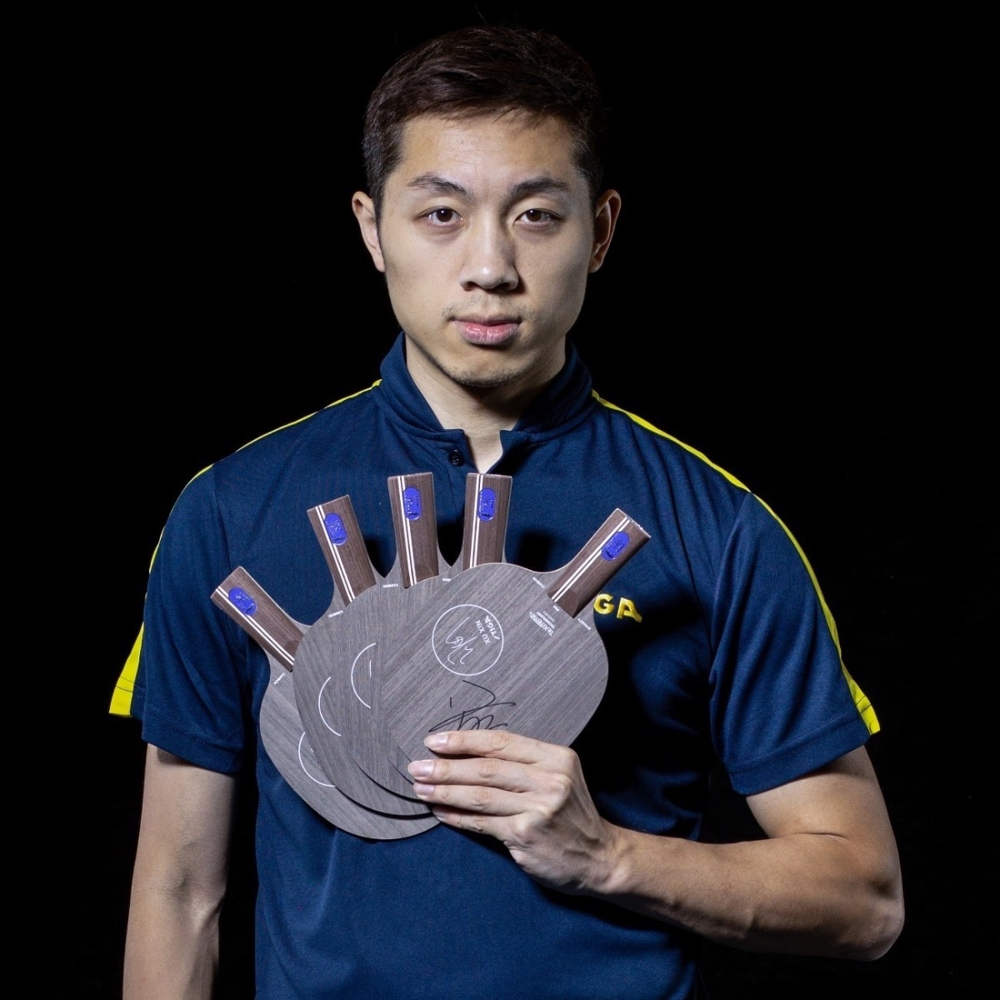
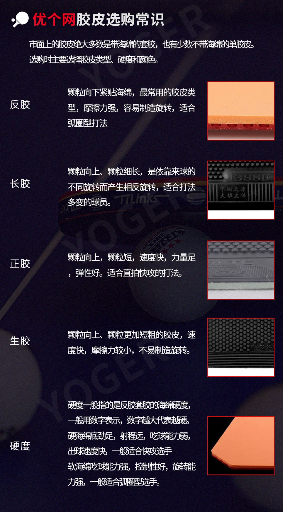

# 胖球群文件 version0_19_09_09

第一版只是抛砖引玉，欢迎各位大佬多多指教。
这里只简单地介绍下器材，场地和训练三个方面，暂时就想到这些，针对可爱的fresh meat们～
希望你们早点顺利加入我们欢乐的胖球圈来～

### 1. 器材

#### 1.0 成品拍

优点：简单省心，价格便宜
缺点：品质层次不齐，需要自己去适应板子
推荐：入门使用，尽早换
讨论：https://www.zhihu.com/question/50378983

#### 1.1 DIY部分
基本知识介绍：
http://www.yoger.com.cn/info-11875.html
http://blog.sina.com.cn/s/blog_010cae8401018do7.html

##### 1.1.1 底板

- 按握拍分类：横板 + 直板（中直 + 日直）+ 其他乱七八糟的

蝴蝶Butterfly 张继科 ZCL 横板

斯帝卡Stiga 碳素王朝 蓝标许昕 直板

蝴蝶 Butterfly サイプレスT-MAX  日直 

- 按材料分类：纯木 + 碳素

斯帝卡北极木 Stiga ARCTIC WOOD 纯木

 

红双喜DHS 狂飙龙五 芳碳

 
- 详细按照手柄：
Englisch + 中文

- Deutsch：Griffformen

底板品牌介绍：http://www.pingpangwang.com/forum.php?mod=viewthread&tid=3792#lastpost

##### 1.1.2 胶皮
- 正胶？反胶？
胶粒朝外：正胶，朝内：反胶。所以我们大多数用的都是反胶。

- 粘性？涩性？
两个都是针对反胶的。
粘性胶皮击球可以使用更小的力量打出旋转
涩性胶皮主要靠击打，需要在胶面和球接触的瞬间，将球“吃”进去，然后通过形变来制造旋转。对技术动作要求比粘套要高。正手使用难度较大，但用在反手或许有奇效。

- 国套？外套？
国内品牌：主要是红大妈(Double happiness DHS)的狂飙系列，天极系列，基本都是粘套。
外套主要是涩套，一般比起国套轻。

红双喜 狂飙三 粘套 国套

蝴蝶 Butterfly Tenergy 05 涩套 外套

挺拔 Tibhar MXP 涩套 外套

 

- 度数？
指的是胶皮的硬度，一般用的话买39度。
如果板子本身太硬的话，可以选择度数稍微低点的。

比如在后买的时候会出现这样的选项，ps 一般黑色做正手

- 灌胶？
http://blog.sina.com.cn/s/blog_010cae8401018dob.html

#### 1.2 附件
- 胶皮保护膜：必要
- 胶皮清洗剂：必要
- 手胶：可选，容易出手汗
- 护边：可选，能防磕边，看个人习惯
- 拍套：最好买个大一点的，能把清洁剂和清理海绵一起放进去

我就直接把我买过的链接放上去：

胶皮保护贴：https://de.butterfly.tt/schutzfolie-film-iii-klebrig.html

清洁剂：https://www.amazon.de/gp/product/B0012QHLTE/ref=ppx_yo_dt_b_asin_title_o05_s00?ie=UTF8&psc=1

增粘剂：https://de.butterfly.tt/spin-refresh-schaumreiniger-150ml.html

手胶：https://de.butterfly.tt/overgrip-3er-pack.html

双面胶：https://de.butterfly.tt/klebefolie-chack-sheet.html

护边和拍套都是国内买的，淘宝你值得拥有，便宜瓷实～

#### 1.3 推荐配置

- 如果一开始不知道怎么买，可以试试俱乐部经典推荐当作过渡，等对各种胶皮有了感觉之后再换：
底板：红双喜N301
正手：省狂3
反手：尤拉敏冲
约 300 + 180 + 180 = 660¥

- 如果希望直接一步到位的话，也有如下推荐：
底板：Butterfly or Stiga or 红双喜最贵的那几款...
胶皮：Butterfly T系列 D系列，红双喜蓝色省狂/国狂，挺拔Evolution系列，骄猛Vega系列等。
- 例1 横板：vis + 双05:
底板Viscaria：1100¥
两面T05：490*2 = 980 ¥
共 2080¥
- 例2 直板：碳素王朝 + T05 + 国狂蓝海棉:
底板蓝标许昕：1880¥
一面国狂蓝海棉：499¥
一面T05: 490¥
共 2779¥

Butterfly Viscaria FL

价格参考均来自优个 http://www.yoger.com.cn/

#### 1.4 平台
- 国外：
蝴蝶官网(DE)：https://de.butterfly.tt/  （JP的Butterfly官网一般不外送）
斯帝卡官网：https://www.stigasports.com/eu/ 
德亚：https://www.amazon.de/ 
日亚：https://www.amazon.co.jp/ （有时候能买到相对德国便宜多的底板，比官网便宜）
eBay：https://www.ebay.de/ （二手市场，质量参差不齐，可能淘到好货，看运气）

- 国内：
优个 http://www.yoger.com.cn/
动库 http://www.dku51.com/
精英乒乓 http://www.ttshop.cn/
红双喜淘宝店  https://dhsyundong.world.tmall.com/

### 2. 场地
KIT内两处木台子：
1. 物理馆30.22 负一层
2. 建筑馆（Mathebau北），三层，建筑系Fachschaft门前

附近还有很多石台子：
1. 物理楼北小森林中 3个
2. Durlach Tor车站教堂后 1个
3. 出校门往南Hauptfriedhof 2个
等等

#### 关于俱乐部
- 地址：Unterfeldstraße, 76149 Karlsruhe（谷歌这个：Sporthalle Schulzentrum Neureut）

- 路线：乘S1/S11至Welschneureuter Str下车

- 时间：周一三五，晚7:30-10:00（其实7点到也没关系）

- 费用：学生年费一年约76欧

- 说明：前3-4次免费，之后找负责人签订一个入会合同即可

- 台子：周一较少，周三周五超过20台

### 3. 训练
#### 发球 
https://www.youtube.com/results?search_query=%E4%B9%92%E4%B9%93%E7%90%83+%E5%8F%91%E7%90%83
#### 接发球
https://www.youtube.com/results?search_query=%E4%B9%92%E4%B9%93%E7%90%83+%E6%8E%A5%E5%8F%91%E7%90%83
#### 基本功练习
https://www.youtube.com/results?search_query=%E4%B9%92%E4%B9%93%E7%90%83+%E5%9F%BA%E6%9C%AC%E5%8A%9F
#### 比赛频道
https://www.youtube.com/channel/UC9ckyA_A3MfXUa0ttxMoIZw

